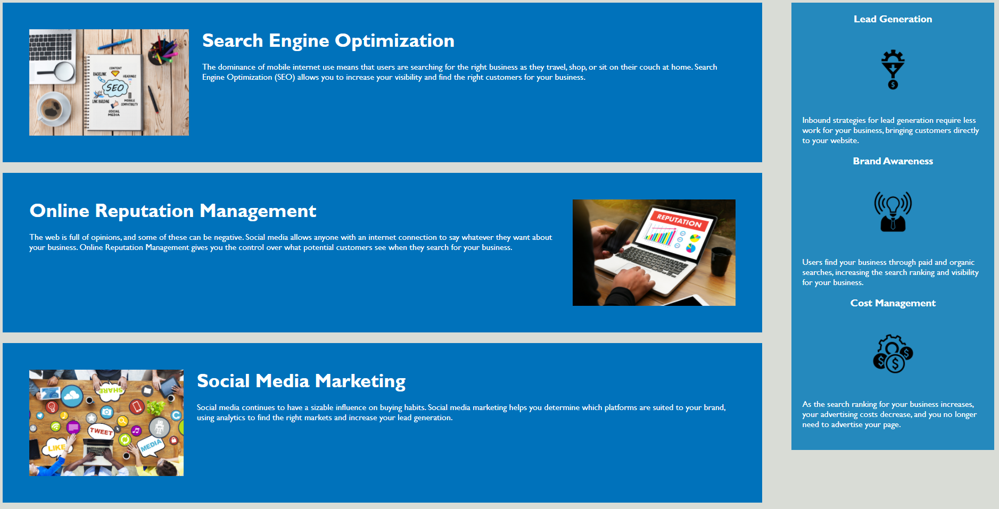

# Horiseon Marketing

Application required code refactoring to prevent use of redundant classes.

Styling was maintained consistent, while code is easier to read and maintain. 

## Future Maintenance

It is suggested that a framework is implemented; considering their versatility and general minimal time consumption to implement, this might be worth looking into.

Certain liberties were taken with the code styling, they do not directly impact the overall style client ordered, however, their code style preferences may vary, and further refactor for more strict coding style guildelines adherence can occur, if unsatisfied.
